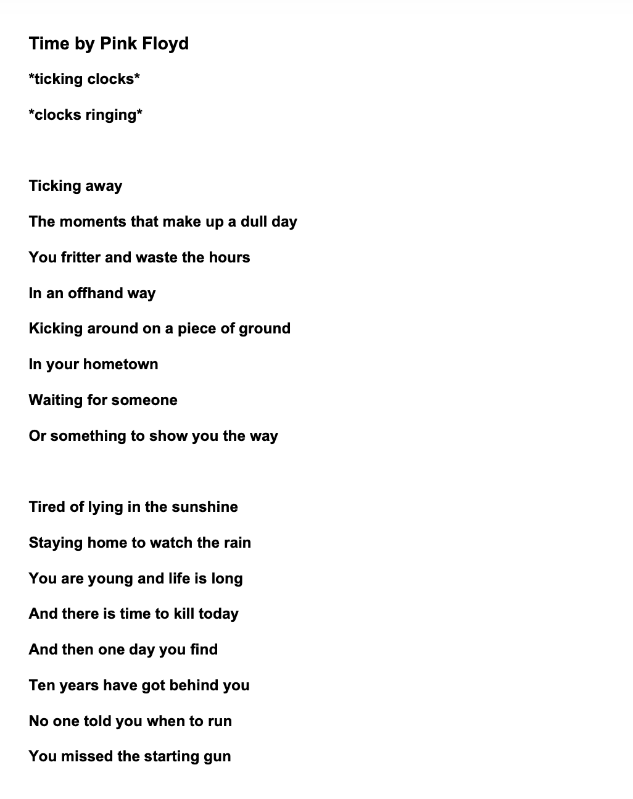

# Lyrics4Setlist

AI-powered tool to read lyrics from a setlist and generate a pdf of lyrics.<br/>




[Sample output PDF](images/Output_sample.pdf)

### Motivation

> I play in string quartet performances of popular music arrangements where a central part of the performance involves speaking to the audience about the music. I find it helpful to have the lyrics for reference, but when listening to the songs I rarely catch them all.
>
> I play up to 20 different shows a month and manually copying (and translating) lyrics for each song is time consuming and exhaustive.
>
> Lyrics4Setlist automates this process, outputting requested lyrics, with translations, in one clean PDF.
>

## Setup

Generate an access token for free at [genius.com/api-clients](genius.com/api-clients) and store it as an environment variable (see `.env.example`).

```
export GENIUS_ACCESS_TOKEN="your-token-here"
```

<br/>

Navigate to backend and create virtual environment:

```
cd backend && python3 -m venv .venv && source .venv/bin/activate
```

### Option 1: Run in Terminal with CSV file as input

Install dependencies:

```
pip install -r requirements.txt
```

<br/>

Run:

```
python3 lyrics.py
```

### Option 2: Run as web API with JSON input

Install dependencies:

```bash
pip install -r requirements-web.txt
```

<br/>
Run:

```
flask run -p 8000
```

And send a JSON request:

```
curl -X POST http://localhost:8000/generate-pdf \
  -H "Content-Type: application/json" \
  -d '{
    "songs": [
      {"title": "Shape of You", "artist": "Ed Sheeran"}
    ]
  }' \
  --output lyrics.pdf
```

## Frontend

In new terminal window:

```
cd ../frontend && pnpm install
```

Run Next JS app:

```
pnpm run dev
```

Navigate to `localhost:3000` in browser. If the backend is running locally, you will be able to generate and download a sample PDF.

---

---

Packages:

- [Tesseract OCR](https://tesseract.projectnaptha.com/) for pulling text from image
- [lyricsgenius](https://lyricsgenius.readthedocs.io/en/master/) for fetching lyrics
- [Googletrans](https://pypi.org/project/googletrans/) for translation
- [FPDF2](https://py-pdf.github.io/fpdf2/index.html]) for PDF generation
