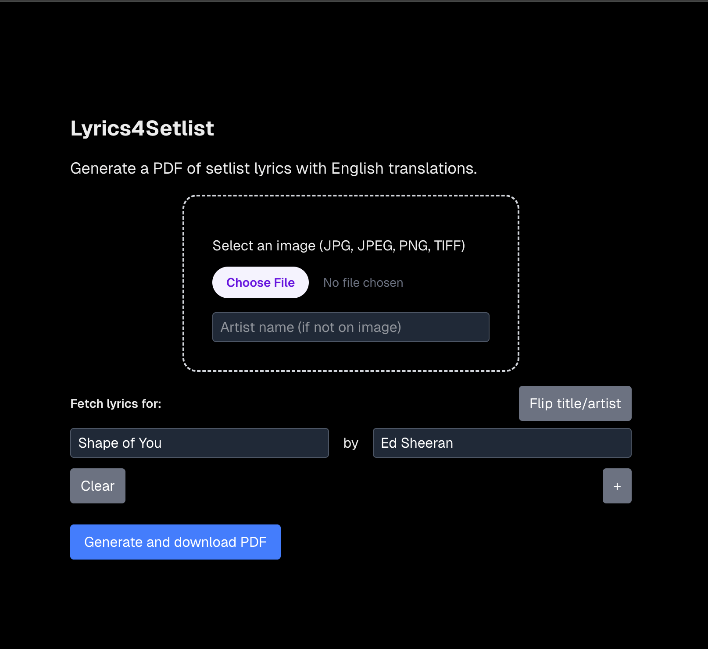

# Lyrics4Setlist

Generate a pdf of lyrics (including translation) given song titles and artists.<br/>

### Motivation

> I play in string quartet performances of popular music arrangements, aimed at connecting musicians and audiences in a small concert format. A central part of the performances involves introducing the music to the audience and speaking about it. I find it helpful to have the lyrics for reference, but when listening to the songs I rarely catch them all. My main focus of my practicing is always on the notes and rhythms.
>
> I study and learn up to 20 different of these shows a month and googling and copying/pasting lyrics for each song is very time consuming and repetitive. Translation, if required, is yet another step. Further, LLM's are unable to automate this process because of lyrics licensing.
>
> Lyrics4Setlist simplifies the process, producing complete lyrics (including translation to English) for requested songs in PDF format, the perfect format for sheet music reading iPad apps such as ForScore. This tool can also be extended to translate lyrics into languages other than English, which is helpful considering that these concerts happen across the globe.
>



### Sample PDF
[Sample.pdf](https://github.com/user-attachments/files/25772117/Sample.pdf)

## Setup

Generate an access token for free at [genius.com/api-clients](genius.com/api-clients) and store it as an environment variable (see `.env.example`).

```
export GENIUS_ACCESS_TOKEN="your-token-here"
```

<br/>

Navigate to backend and create virtual environment:

```
cd backend && python3 -m venv .venv && source .venv/bin/activate
```

### Option 1: Run in Terminal with CSV file as input

Install dependencies:

```
pip install -r requirements.txt
```

<br/>

Run:

```
python3 lyrics.py
```

### Option 2: Run as web API with JSON input

Install dependencies:

```bash
pip install -r requirements-web.txt
```

<br/>
Run:

```
flask run -p 8000
```

And send a JSON request:

```
curl -X POST http://localhost:8000/generate-pdf \
  -H "Content-Type: application/json" \
  -d '{
    "songs": [
      {"title": "Shape of You", "artist": "Ed Sheeran"}
    ]
  }' \
  --output lyrics.pdf
```

## Frontend

In new terminal window:

```
cd ../frontend && pnpm install
```

Run Next JS app:

```
pnpm run dev
```

Navigate to `localhost:3000` in browser. If the backend is running locally, you will be able to generate and download a sample PDF.

---

---

Packages:

- [lyricsgenius](https://lyricsgenius.readthedocs.io/en/master/) for fetching lyrics
- [Googletrans](https://pypi.org/project/googletrans/) for translation
- [FPDF2](https://py-pdf.github.io/fpdf2/index.html]) for PDF generation
